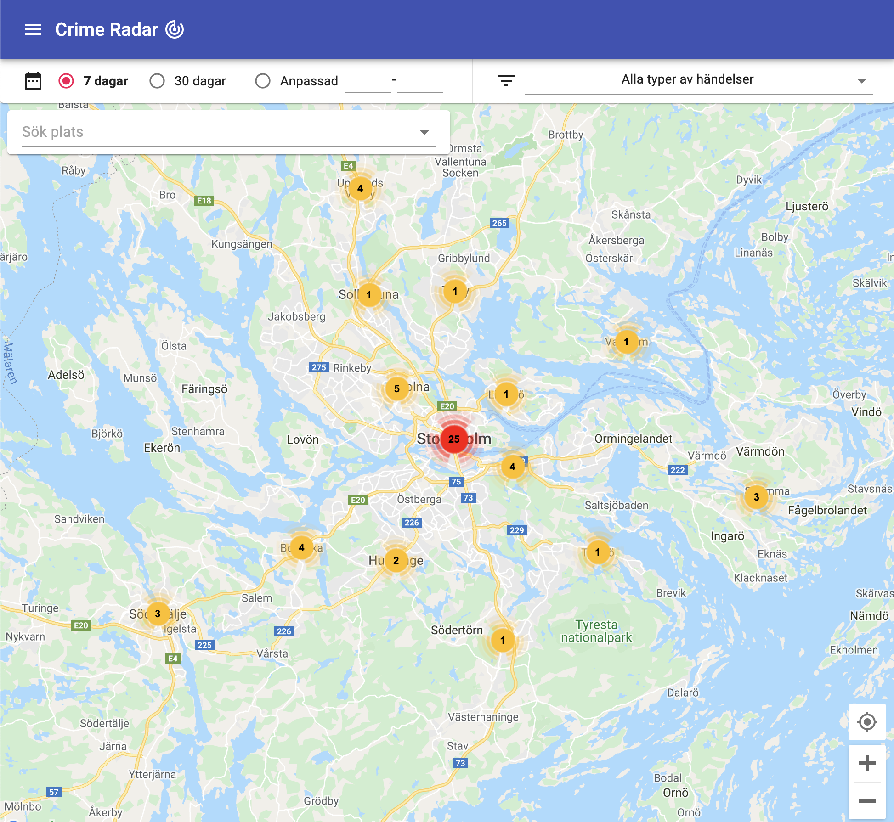

[![Contributors][contributors-shield]][contributors-url]
[![Forks][forks-shield]][forks-url]
[![Issues][issues-shield]][issues-url]
[![MIT License][license-shield]][license-url]
[![LinkedIn][linkedin-shield]][linkedin-url]
[![Netlify Status][netlify-shield]][netlify-url]
[![Heroku Status][heroku-shield]][heroku-url]

<!-- PROJECT LOGO -->
 

  <h3 align="center">Crime Radar</h3>

  

    Keep track of crimes that happen in your area
     
    <a href="https://github.com/toblu/crime-radar"><strong>Explore the docs »</strong></a>
     
     
    <a href="https://crimeradar.se">View Website</a>
    ·
    <a href="https://github.com/toblu/crime-radar/issues">Report Bug</a>
    ·
    <a href="https://github.com/toblu/crime-radar/issues">Request Feature</a>
  

<!-- TABLE OF CONTENTS -->

  
Table of Contents

  <ol>
    <li>
      <a href="#about-the-project">About The Project</a>
      <ul>
        <li><a href="#built-with">Built With</a></li>
      </ul>
    </li>
    <li><a href="#roadmap">Roadmap</a></li>
    <li><a href="#license">License</a></li>
    <li><a href="#contact">Contact</a></li>
    <li><a href="#acknowledgements">Acknowledgements</a></li>
  </ol>

<!-- ABOUT THE PROJECT -->

## About The Project

Crime Radar is a web application that displays crimes and related events from the police across Sweden with an interactive map. The user can filter on time periods and specific types of crimes, as well as zoom in a specific area or use current location to see crimes that have happened nearby the users current position. All data is fetched from an open <a href="https://polisen.se/kontakt/om-webbplatsen/oppna-data/api-over-polisens-handelser/">API</a> provided by the Swedish Police authority as well as from <a href="https://polisen.se/aktuellt/polisens-nyheter">events</a> published on their website.

### Built With

-   [React](https://reactjs.org/)
-   [GraphQL](https://graphql.org/)
-   [Apollo](https://www.apollographql.com/)
-   [NodeJS](https://nodejs.org/en/)
-   [AWS](https://aws.amazon.com/)
-   [Serverless](https://www.serverless.com/)
-   [MongoDB Atlas](https://www.mongodb.com/cloud/atlas)

<!-- ROADMAP -->

## Roadmap

See the [open issues](https://github.com/toblu/crime-radar/issues) for a list of proposed features (and known issues).

<!-- LICENSE -->

## License

Distributed under the MIT License. See `LICENSE` for more information.

<!-- CONTACT -->

## Contact

Tobias Lundell - [LinkedIn][linkedin-url] - lundell.tobias@gmail.com

Project Link: [https://github.com/toblu/crime-radar](https://github.com/toblu/crime-radar)

<!-- ACKNOWLEDGEMENTS -->

## Acknowledgements

-   [Material UI](https://material-ui.com/)
-   [React Google Maps](https://tomchentw.github.io/react-google-maps/)
-   [Google Maps Platform](https://developers.google.com/maps)
-   [Express](https://expressjs.com/)
-   [Netlify](https://www.netlify.com/)
-   [Heroku](https://heroku.com)
-   [Create React App](https://create-react-app.dev/)
-   [TypeScript](https://www.typescriptlang.org/)
-   [Img Shields](https://shields.io)

[contributors-shield]: https://img.shields.io/github/contributors/toblu/crime-radar.svg?style=for-the-badge
[contributors-url]: https://github.com/toblu/crime-radar/graphs/contributors
[forks-shield]: https://img.shields.io/github/forks/toblu/crime-radar.svg?style=for-the-badge
[forks-url]: https://github.com/toblu/crime-radar/network/members
[issues-shield]: https://img.shields.io/github/issues/toblu/crime-radar.svg?style=for-the-badge
[issues-url]: https://github.com/toblu/crime-radar/issues
[license-shield]: https://img.shields.io/github/license/toblu/crime-radar.svg?style=for-the-badge
[license-url]: https://github.com/toblu/crime-radar/blob/master/LICENSE
[linkedin-shield]: https://img.shields.io/badge/-LinkedIn-black.svg?style=for-the-badge&logo=linkedin&colorB=555
[linkedin-url]: https://linkedin.com/in/tobiaslundell
[netlify-shield]: https://api.netlify.com/api/v1/badges/084a29c6-0125-422b-89de-b170d2dd6b33/deploy-status
[netlify-url]: https://app.netlify.com/sites/focused-spence-b6d911/deploys
[heroku-shield]: https://heroku-status-badges.herokuapp.com/crime-alert-server
[heroku-url]: https://dashboard.heroku.com/apps/crime-alert-server/activity
